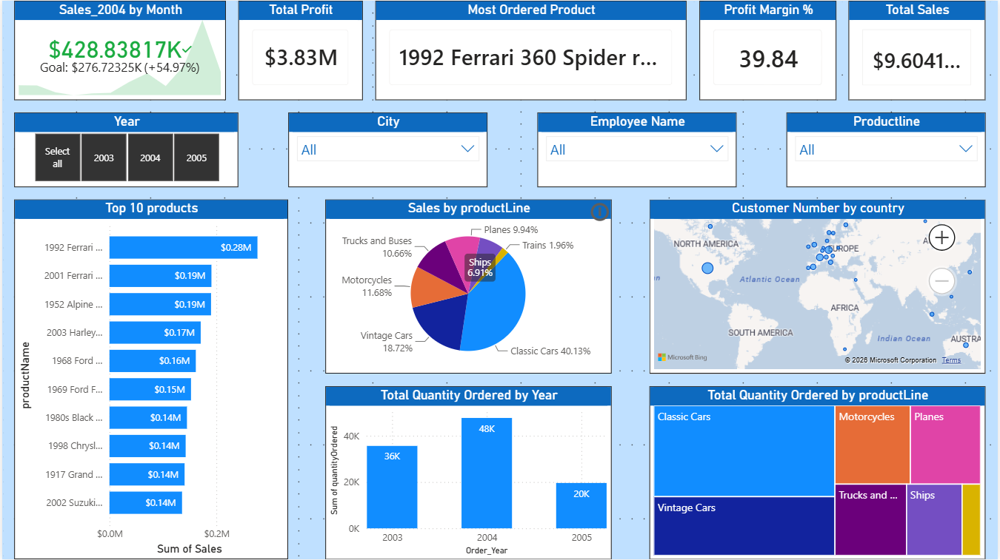

# Classic Models Sales Analysis Dashboard | Power BI

  

## Tech Stack

| Category | Tools |
|----------|-------|
| BI Tool | Microsoft Power BI |
| Data Preparation | Power Query |
| Data Modeling | Star/Snowflake Schema |
| Language | DAX |
| Dataset | Classic Models |
| Visualization | KPI Cards, Maps, Bar, Line & Pie Charts |

## Project Overview

This project presents an end-to-end Business Intelligence solution built using **Microsoft Power BI** on the **Classic Models** dataset. The dashboard transforms raw transactional data into meaningful business insights through interactive visualizations, KPI tracking, and drill-through analysis.

The project demonstrates the complete Power BI workflow—from importing and transforming relational datasets to building an optimized data model, creating DAX measures, and designing an interactive dashboard for business decision-making.

Rather than simply visualizing data, this project focuses on answering important business questions related to sales performance, profitability, product performance, customer distribution, and employee contributions.

---

# Executive Summary

Organizations generate thousands of sales transactions every year, making it difficult to identify trends and business opportunities without effective reporting tools.

The objective of this project was to build an interactive sales dashboard capable of monitoring overall business performance while allowing users to explore detailed insights across different dimensions such as:

- Sales Performance
- Product Categories
- Customer Locations
- Employees
- Time (Year & Month)
- Profitability

Using Power BI, a complete analytical solution was developed by integrating multiple related tables from the Classic Models database. The dashboard enables users to monitor KPIs, compare yearly performance, analyze product lines, identify top-performing products, and understand customer distribution across different countries.

The final solution provides management with an intuitive interface for exploring sales trends, identifying high-performing products, and supporting data-driven business decisions.

---

# Business Problem

Businesses often store operational data across multiple tables, making it difficult to gain meaningful insights without proper data modeling and visualization.

Management requires a centralized dashboard capable of answering questions such as:

- Which products generate the highest revenue?
- Which product line performs the best?
- How profitable is the business?
- Which year generated the highest sales?
- Which months experience peak sales?
- Where are customers located?
- Which employees manage the highest number of customers?

Instead of manually analyzing thousands of records, this dashboard provides instant answers through interactive visualizations.

---

# Project Objectives

The primary objectives of this project were:

- Build an interactive sales dashboard using Microsoft Power BI.
- Integrate multiple related tables into a relational data model.
- Perform data cleaning and transformation using Power Query.
- Create meaningful KPIs using DAX.
- Analyze sales performance across different years.
- Identify top-performing products and product lines.
- Visualize customer distribution geographically.
- Provide drill-through capability for detailed product analysis.
- Design a professional dashboard suitable for business reporting.

---

# Business Questions

This dashboard was designed to answer the following business questions:

1. What are the total sales generated by the company?
2. What is the total profit earned?
3. What is the overall profit margin?
4. Which product generated the highest sales?
5. Which product line contributes the highest revenue?
6. Which year recorded the highest sales performance?
7. How does monthly sales performance vary throughout the year?
8. Which product lines receive the highest order quantity?
9. Which countries have the largest customer base?
10. How do sales vary by city and employee?
11. Which products contribute most significantly to revenue?
12. How can users drill down into product-level analysis?

---

# Dataset Information

The project uses the **Classic Models Dataset**, a sample relational database representing a company that sells scale model vehicles.

The dataset contains information about:

- Customers
- Orders
- Order Details
- Products
- Product Lines
- Employees
- Offices
- Payments

The project consists of **8 CSV files** imported into Power BI.

| Table | Description |
|---------|-------------|
| Customers | Customer information |
| Orders | Order records |
| Order Details | Product-level sales transactions |
| Products | Product catalog |
| Product Lines | Product categories |
| Employees | Sales representatives |
| Offices | Office locations |
| Payments | Customer payment information |

The tables are connected through primary and foreign key relationships to create a relational data model.

---

# Tools & Technologies

- Microsoft Power BI
- Power Query
- DAX (Data Analysis Expressions)
- Data Modeling
- Interactive Dashboard Design
- Drill-through Analysis
- KPI Reporting
- Geospatial Visualization

---

# Skills Demonstrated

This project demonstrates practical experience in:

- Data Cleaning
- Data Transformation
- Data Modeling
- Power Query
- DAX
- Dashboard Design
- Data Visualization
- Business Intelligence
- Interactive Reporting
- Analytical Thinking
- Business Storytelling

# Data Preparation

Before building the dashboard, the dataset was cleaned and transformed using **Power Query** to ensure data quality, consistency, and accurate reporting. Since the Classic Models dataset consists of multiple related tables, proper preprocessing was essential for building a reliable analytical model.

The transformation process focused on improving data usability while maintaining the integrity of relationships between tables.

---

# Power Query Transformations

The following data preparation steps were performed:

### Data Cleaning

- Imported all CSV files into Power BI.
- Verified and corrected data types for each column.
- Removed null and unnecessary values where applicable.
- Renamed columns to improve readability and consistency.
- Standardized field names across related tables.

### Feature Engineering

Several additional columns were created to improve reporting capabilities:

- Created **Full Name** by combining first and last names.
- Extracted **Order Year** from the order date.
- Extracted **Month Number** for chronological sorting.
- Created **Month Name** for dashboard visualization.
- Generated additional date-related fields for time-based analysis.

These transformations simplified report development and reduced the need for repetitive calculations within visuals.

---

# Data Modeling

A relational data model was created by establishing relationships between all tables based on their primary and foreign keys.

The model follows a **hybrid Star/Snowflake schema**, allowing efficient filtering, aggregation, and cross-table analysis.

  

### Key Relationships

| From Table | To Table | Relationship |
|------------|----------|--------------|
| Customers | Orders | One-to-Many |
| Orders | Order Details | One-to-Many |
| Products | Order Details | One-to-Many |
| Product Lines | Products | One-to-Many |
| Employees | Customers | One-to-Many |
| Offices | Employees | One-to-Many |
| Customers | Payments | One-to-Many |

This structure enables users to analyze sales across customers, products, employees, offices, and time dimensions while maintaining referential integrity.

---

# Calculated Columns

To enhance reporting and simplify analysis, several calculated columns were created.

| Calculated Column | Purpose |
|-------------------|---------|
| Full Name | Combines employee first and last names |
| Order Year | Enables yearly sales analysis |
| Month Number | Maintains chronological month order |
| Month Name | Used for monthly visualizations |

These columns improve report readability and eliminate repetitive transformations during visualization.

---

# DAX Measures

Several reusable DAX measures were created to calculate business KPIs dynamically.

## Total Sales

Calculates the overall revenue generated from all orders.

**Purpose**

- KPI Cards
- Product Analysis
- Trend Analysis
- Sales Comparisons

---

## Total Profit

Calculates the total profit earned across all transactions.

**Purpose**

- Profit Analysis
- Business Performance
- Financial KPIs

---

## Profit Margin %

Measures profitability by comparing profit against total sales.

**Purpose**

- Financial Performance
- Business Health
- Profitability Comparison

---

## Sales_2003

Calculates total sales for the year **2003**.

Used for:

- Year-over-Year comparison
- KPI Cards
- Historical performance analysis

---

## Sales_2004

Calculates total sales for the year **2004**.

Used for:

- Growth comparison
- Performance benchmarking
- Executive KPI reporting

---

# Dashboard Design

The dashboard was designed with the goal of enabling users to explore business performance from multiple perspectives while keeping navigation simple and intuitive.

The report consists of **two interactive pages**.

## Page 1 – Executive Dashboard

Designed for high-level business monitoring.

This page provides an overview of:

- Sales performance
- Profitability
- Product performance
- Geographic customer distribution
- Yearly sales trends
- Product line contribution
- Quantity ordered

It serves as an executive summary where decision-makers can quickly evaluate overall business performance.

---

## Page 2 – Product Analysis (Drill-through)

A dedicated drill-through page allows users to perform detailed product-level analysis.

Users can investigate:

- Sales by Product Line
- Quantity Ordered by Product Line
- Sales by Product
- Quantity Ordered by Product
- Monthly Sales Trend

This page supports deeper exploration without overcrowding the main dashboard.

---

# Interactive Features

To enhance usability and improve the analytical experience, several Power BI features were incorporated.

### Slicers

Users can filter the report by:

- Year
- City
- Employee
- Product Line

Every visual updates dynamically based on the selected filters.

---

### KPI Cards

The dashboard displays key business metrics, including:

- Total Sales
- Total Profit
- Profit Margin %
- Most Ordered Product
- Sales Performance

These cards provide an instant snapshot of overall business performance.

---

### Drill-through Navigation

Users can right-click on relevant visuals and navigate directly to a dedicated product analysis page for more detailed insights.

This enables both executive-level monitoring and detailed operational analysis within the same report.

---

### Tooltips

Custom tooltips provide additional context when hovering over visuals, improving the user experience without adding unnecessary clutter.

---

### Bookmarks & Navigation

Bookmarks and navigation buttons improve report usability by allowing seamless movement between dashboard pages while maintaining filter context.

---

# Dashboard Design Principles

Several design principles were followed to improve readability and user experience:

- Consistent color palette throughout the report
- Clear visual hierarchy
- Interactive filtering
- Minimal visual clutter
- Business-focused KPIs
- Balanced spacing and alignment
- Appropriate chart selection for each metric
- Easy navigation between overview and detailed analysis

The final dashboard is designed to support both executive reporting and operational decision-making.

# Dashboard Walkthrough

The dashboard is designed to provide both a high-level executive overview and detailed product-level analysis. Interactive filters, KPIs, and drill-through functionality allow users to seamlessly explore business performance from different perspectives.

---

# Dashboard Page 1 – Executive Sales Dashboard

The main dashboard presents a comprehensive overview of the company's sales performance through a combination of KPI cards, trend analysis, geographical insights, and product-level visualizations.

## Key Performance Indicators (KPIs)

The dashboard highlights the most important business metrics at the top for quick monitoring.

### Total Sales

Displays the total revenue generated from all completed sales transactions.

**Business Value**

- Measures overall business performance.
- Serves as the primary indicator of company growth.
- Helps management evaluate revenue generation over different time periods.

---

### Total Profit

Shows the total profit earned from all sales.

**Business Value**

- Evaluates financial performance.
- Helps determine business sustainability.
- Supports profitability analysis across products and time.

---

### Profit Margin %

Calculates the percentage of profit generated from total sales.

**Business Value**

- Indicates operational efficiency.
- Measures overall business health.
- Assists management in evaluating pricing strategies.

---

### Most Ordered Product

Displays the product with the highest number of customer orders.

**Business Value**

- Identifies products with consistently high demand.
- Supports inventory planning.
- Helps prioritize production and stock management.

---

# Sales Trend Analysis

A line chart visualizes monthly sales performance over time.

The trend analysis enables users to:

- Monitor seasonal demand.
- Detect sales peaks and slow periods.
- Compare monthly business performance.
- Understand purchasing behavior throughout the year.

This visualization provides valuable insights into sales seasonality and long-term business trends.

---

# Product Line Performance

A bar chart compares sales generated by each product line.

This visualization answers questions such as:

- Which product category generates the highest revenue?
- Which categories underperform?
- How balanced is revenue across different product lines?

From the analysis:

- **Classic Cars** emerged as the highest-performing product line, contributing the largest share of total sales.
- Other product lines generated comparatively lower revenue, indicating opportunities for focused marketing or inventory optimization.

---

# Quantity Ordered by Product Line

A pie chart illustrates the distribution of total order quantities among product lines.

This visualization helps identify customer purchasing preferences and demand distribution across different product categories.

Understanding order volume enables businesses to:

- Improve inventory planning.
- Forecast future demand.
- Optimize warehouse operations.

---

# Geographic Customer Distribution

The map visualization displays customer locations across different countries and regions.

Business value includes:

- Identifying key customer markets.
- Understanding regional demand.
- Supporting market expansion decisions.
- Assisting territory management.

The analysis shows a strong concentration of customers across Europe, indicating the region's significant contribution to the business.

---

# Sales by Product

A horizontal bar chart compares total sales generated by individual products.

This allows management to:

- Identify best-selling products.
- Compare product performance.
- Detect low-performing inventory.
- Support pricing and promotional strategies.

The dashboard identifies the **1992 Ferrari 360 Spider Red** as the highest-selling product in terms of revenue.

---

# Interactive Filters

The executive dashboard includes multiple slicers that allow users to dynamically explore the data.

Available filters include:

- Year
- City
- Employee
- Product Line

Selecting any filter automatically updates all visuals on the page, enabling interactive and focused analysis without requiring additional reports.

---

# Dashboard Page 2 – Product Analysis (Drill-through)

The second page is a dedicated drill-through report designed for detailed product-level exploration.

Rather than overwhelming the executive dashboard with additional visuals, drill-through functionality allows users to investigate selected products in greater detail.

The page includes:

- Monthly Sales Trend
- Sales by Product Line
- Quantity Ordered by Product Line
- Sales by Product
- Quantity Ordered by Product

This enables users to move from high-level KPIs to detailed operational insights with a single interaction.

---

# Key Business Insights

Based on the dashboard analysis, several meaningful insights can be derived.

## 1. Classic Cars Drive the Business

Classic Cars contribute the highest sales among all product lines, making them the company's strongest revenue-generating category.

**Business Impact**

- Continue investing in this product line.
- Prioritize inventory availability.
- Increase promotional activities around high-performing models.

---

## 2. 1992 Ferrari 360 Spider Red Is the Best-Selling Product

Among all products, the **1992 Ferrari 360 Spider Red** generates the highest sales.

**Business Impact**

- Maintain sufficient stock levels.
- Consider premium pricing strategies.
- Use the product in promotional campaigns.
- Analyze similar products for cross-selling opportunities.

---

## 3. Sales Peaked in 2004

Year-over-year comparison indicates that **2004** achieved higher sales than **2003**.

**Business Impact**

- Investigate factors contributing to growth.
- Replicate successful sales strategies in future periods.
- Benchmark future performance against 2004.

---

## 4. November Recorded the Highest Sales

Monthly trend analysis reveals that **November** experienced the highest sales volume.

**Business Impact**

- Increase inventory before peak season.
- Launch targeted marketing campaigns during high-demand months.
- Optimize staffing and logistics to accommodate increased sales.

---

## 5. Strong Overall Profitability

The dashboard reports an overall **Profit Margin of approximately 39.84%**, indicating healthy financial performance.

**Business Impact**

- Current pricing strategies appear effective.
- Opportunity exists to further optimize profit through cost reduction or premium offerings.
- Profit margin can serve as a benchmark for future performance evaluation.

---

## 6. Europe Represents a Key Customer Market

The geographic visualization indicates that Europe contains the highest concentration of customers.

**Business Impact**

- Continue strengthening customer relationships within the region.
- Explore expansion into neighboring markets.
- Allocate marketing resources based on regional demand.

---

# Business Recommendations

Based on the findings, the following recommendations can help improve business performance:

- Increase investment in high-performing product lines, particularly Classic Cars.
- Maintain optimal inventory levels for best-selling products to prevent stock shortages.
- Use historical monthly sales trends to improve demand forecasting and inventory planning.
- Expand marketing efforts in regions with strong customer presence while identifying opportunities in underperforming markets.
- Continuously monitor profit margins to ensure sustainable growth and effective pricing strategies.
- Leverage drill-through analysis to identify low-performing products that may require pricing adjustments, promotional support, or discontinuation.

The dashboard provides decision-makers with a centralized platform for monitoring business performance, identifying growth opportunities, and making informed, data-driven decisions.

# Technical Skills Demonstrated

This project showcases a wide range of Business Intelligence and Data Analytics skills that are essential for entry-level Data Analyst roles.

## Data Preparation

* Imported and integrated multiple CSV datasets.
* Cleaned and transformed data using Power Query.
* Corrected data types and standardized fields.
* Created calculated columns for improved reporting.
* Prepared data for analytical modeling.

---

## Data Modeling

* Built relationships between multiple tables.
* Developed a hybrid Star/Snowflake schema.
* Optimized the data model for interactive reporting.
* Maintained referential integrity across the dataset.

---

## DAX

Created reusable measures to calculate key business metrics, including:

* Total Sales
* Total Profit
* Profit Margin %
* Sales_2003
* Sales_2004

These measures enabled dynamic calculations that automatically respond to user selections and report filters.

---

## Data Visualization

Designed an executive dashboard using a variety of visualizations, including:

* KPI Cards
* Line Charts
* Bar Charts
* Pie Charts
* Map Visualizations
* Interactive Slicers

Each visualization was selected to communicate business insights clearly and effectively.

---

## Dashboard Development

Implemented several advanced Power BI features, including:

* Power Query
* Data Modeling
* Relationships
* DAX Measures
* Drill-through Navigation
* Bookmarks
* Tooltips
* Interactive Filters
* Cross-filtering Between Visuals

These features improve usability and allow users to explore the data from multiple perspectives.

---

# Challenges Faced

As this was my first Power BI project, I encountered several challenges throughout the development process.

Some of the key challenges included:

* Understanding relational data modeling.
* Building relationships between multiple tables.
* Learning DAX syntax and measure creation.
* Designing an intuitive dashboard layout.
* Creating meaningful KPIs.
* Configuring drill-through functionality.
* Optimizing visuals for readability and performance.

Each challenge provided valuable hands-on experience and significantly improved my understanding of Power BI and Business Intelligence concepts.

---

# Learning Outcomes

Through this project, I gained practical experience in developing end-to-end Power BI solutions.

Some of the major takeaways include:

* Understanding how relational databases are structured.
* Building effective data models.
* Cleaning and transforming data using Power Query.
* Creating reusable DAX measures.
* Designing interactive dashboards.
* Applying data visualization best practices.
* Converting raw business data into actionable insights.
* Presenting analytical findings in a business-friendly format.

This project strengthened both my technical knowledge and my ability to communicate insights through data.

---

# Dashboard Preview

## Executive Dashboard

---

## Product Analysis (Drill-through)

---

## Data Model

---

# Conclusion

This project demonstrates the complete workflow of developing an interactive Business Intelligence solution using Microsoft Power BI.

Starting from raw relational data, the project involved data cleaning, transformation, data modeling, DAX measure creation, and dashboard development to deliver meaningful business insights.

The dashboard enables users to monitor sales performance, evaluate profitability, analyze product trends, and explore customer distribution through an intuitive and interactive reporting interface.

Beyond creating visualizations, this project highlights the importance of transforming raw business data into actionable insights that support informed decision-making. It also reflects my growing understanding of data modeling, analytical thinking, and business storytelling using Power BI.

As my first Power BI project, it marks an important milestone in my journey toward becoming a Data Analyst and provides a strong foundation for more advanced Business Intelligence projects in the future.

---

